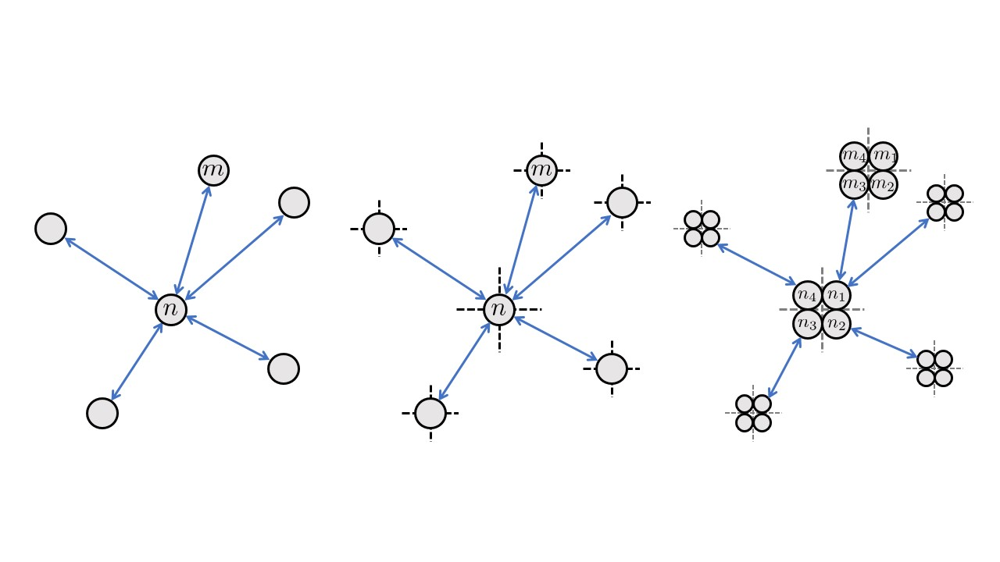

    

  
<html lang="en">
<head>
    <meta charset="UTF-8">
    <meta name="viewport" content="width=device-width, initial-scale=1.0">
    <title>Catalog-Z Bootstrap 5.0 HTML Template</title>
    <link rel="stylesheet" href="css/bootstrap.min.css">
    <link rel="stylesheet" href="fontawesome/css/all.min.css">
    <link rel="stylesheet" href="css/templatemo-style.css">

  
</head>
<body>
    <!-- Page Loader -->
    

        

        

        

    

    

    

    

        

            

        	

                <figure class="effect-ming tm-video-item">
                    
                    <figcaption class="d-flex align-items-center justify-content-center">
                        <h2>View &nbsp more</h2>
                        <a href="quantum-detail.html">View more</a>
                    </figcaption>                    
                </figure>
                

                    Quantum Networks for the Quantum Internet
                    
                

            

            

                <figure class="effect-ming tm-video-item">
                    
                    <figcaption class="d-flex align-items-center justify-content-center">
                        <h2>View &nbsp more</h2>
                        <a href="photo-detail.html">View more</a>
                    </figcaption>                    
                </figure>
                

                    Directional Sectorized mmWave Networks
                    
                

            

            
 <!-- row -->
            
 <!-- container-fluid, tm-container-content -->

            

        

            

                <figure class="effect-ming tm-video-item">
                    
                    <figcaption class="d-flex align-items-center justify-content-center">
                        <h2>View &nbsp more</h2>
                        <a href="photo-detail.html">View more</a>
                    </figcaption>                    
                </figure>
                

                    Satisfaction Form Games 
                    
                

                 

                     &nbsp &nbsp &nbsp &nbsp &nbsp &nbsp &nbsp  &nbsp &nbsp &nbsp for Network Resource Allocation
                    
                

            

            

                <figure class="effect-ming tm-video-item">
                    
                    <figcaption class="d-flex align-items-center justify-content-center">
                        <h2>View &nbsp more</h2>
                        <a href="photo-detail.html">View more</a>
                    </figcaption>                    
                </figure>
                

                    Mechanism Design in 5G Network Slicing
                    
                

            

                   
 <!-- row -->
            
 <!-- container-fluid, tm-container-content -->
            
            
            
            
            
           
            
              
        
       
    
    
    
    
    
</body>
</html>

  
## About Me

## Research

### Scheduling & Routing in Networks

#### Quantum Networks

#### Sectorized Directional Wireless Networks

### Resource Allocation & Network Economics

#### Power Control

#### Network Slicing in 5G

## Conctact

Panagiotis Promponas \
Departement of Electrical Engineering, Yale University \
17 Hillhouse, New Haven, CT, 06511 \
[panagiotis.promponas@yale.edu](mailto:panagiotis.promponas@yale.edu)
